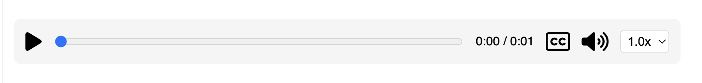

Comparing the implemented audio playback bar

**Dalenia** 

- adjust the playback speed by repeatedly clicking a button, cycling through the available speed options of 1.0x, 1.5x, 2.0x 

- caption button turns dark red when clicked to indicate it is on 

- separated the .css & .js file used for implementing the audio file 

**Amy**

- choose the playback speed from a list of predefined options; 0.5x, 1x, 1.5x, 2x using a dropdown

- wrote the css & js for the audio back in the inside the existing files 

- volume control bar originally opened horizonatally next to the logo, changed it so it opens vertically above the logo after comparing 

- location of the audio bar fixed to the bottom of each slide 

**Overall Thoughts:**

- Volume controls in Amy's version was originally horizontal, changed it to vertical based on prior feedback

- Dropdown for speed controls offer more flexibility 

- Color schemes for both are different, may be good for different use cases (eg. user preference, visibility issues, etc...)

- Audio playback bar should stick to the bottom of the slide, however, overlap with the slide number is noticeable on some device screens.

- Audio playback bar being 90% width seems better visually.

&nbsp;

- Think it's good practice to separate files associated with each features like Daelenia’s to increase readability and avoid complexity later on 

- For implementation, Daelenia created a new custom HTML element that inherits from standard HTML elements, introducing an interesting new method to learn  

- Was a chance to learn other concepts like shadow DOM, which encapsulates JavaScript and CSS, making them hidden from the main document
