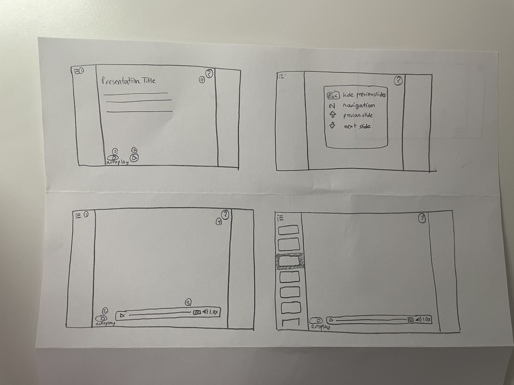
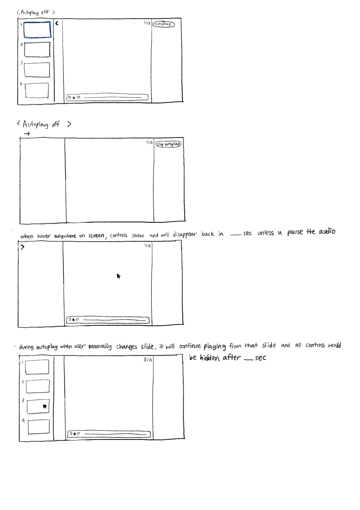
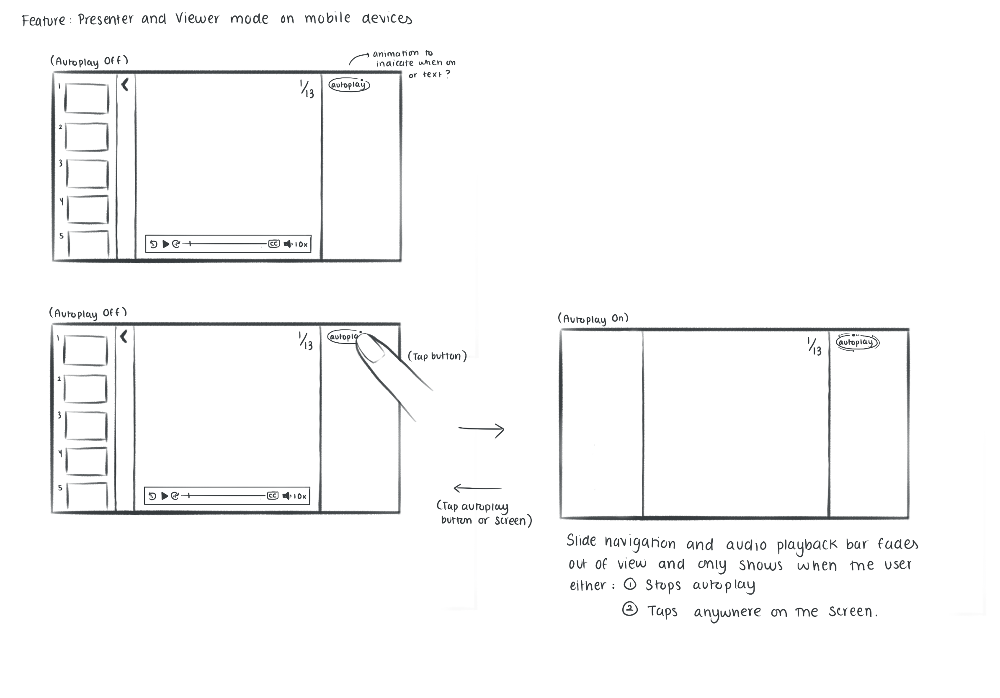

Feedback from friends F1 F2, F3, F4, & F5

**Feature #1 : Audio Playback Bar**

- Both expected to click the button on the bottom left of the default view to expand the audio playback bar.
- F1 expected volume button to show a slider that pops upwards.
- F2 expected the caption button to either show the captions in a default language (referenced Youtube's closed captions button) or show options for multiple languages then choose one.

- All expected this to be the playback bar of the full presentation instead of each slides
- Both F3 & F4 prefered the audio bar to be shown when click the play logo to avoid any clustering and hiding any presentation elements
- F5 preferred the audio playback bar to be open by default due to less clicking
- F3 thought good use of the standard play symbol

**Feature #2 : Help Page**

- Both clicked the ? button on the top right of the default view.
- F1 expected to open a new window (due to unfamiliarity with clicking help pages), F2 anticipated a pop-up window.
- Suggested having more navigation like a table of contents or menu to choose sections from.
- Both wanted to be able to jump to certain sections and go back to the top of the help page easily.

- Expectations of the logo (question mark) aligned with its actual function
- F4 thought it was unnecessary as the the described keyboard shortcuts are what most people expect

**Feature #3 : Slide Navigation**

- Both clicked the hamburger button on the top left corner of the default view.
- Both suggested showing the total number of slides and what slide number you are currently on (eg. Slide 1/12).
- Both expected to close the panel by clicking the hamburger button again.
- Both expected to use the arrow keys or click the screen to go to the next slide.

- F3 was confused what the logo does until I instructed its function
- F4 thought the `esc` button and `N` button to open and close the slide navigation was unnecessary as most people would expect to click the logo for such function
- F4 expected to control the arrows for moving around the slides
- F5 wanted the slide number to be shown

**Feature #4 : Autoplay**

- F1 found the autoplay toggle button unfamiliar, F2 thought it was fine.
- F1 expected something similar to the “Live” Tag on Twitch/Youtube when you’re watching a livestream to indicate when autoplay is on.
- Both emphasized wanting a slide number on the bottom corner.
- Alternatively, F2 suggested having the slide navigation panel open on the left that updates/highlights the new slide as autoplay changes slides.
- F2 said no other indicator was needed as the slides change.

- All thought it was a good feature
- All clearly understood what the purpose is

We found the need to distinguish the experience into two modes: the presenter mode (with full controls visible) and the viewer mode (passive viewing). 

Feedback:
- In viewing mode, there should be a call to action and the ability to stop/pause
- When in viewing mode, the user still needs to have the ability to go back to previous slides. Therefore, they still need some control
- Ideas suggesting mimicking a video playing were suggested
- Potential consideration: have the audio remember where it was last stopped so when the user comes back, it continues rather than start over.

**Feature #4.5 : Presenter and Viewer Modes (expands on the autoplay)**

Details:
- "autoplay" becomes the toggle to transition into "viewing mode" when turned on.
- When autoplay is turned on, everything but the slides themselves (and the autoplay button) is hidden from view. Audio continues to autoplay in the background.
- User can still pause or use keyboard shortcuts to navigate between slides. When they do so and autoplay is on, the controls come into view.
- Controls only stay in view if the user pauses while on autoplay.
- Turning off autoplay brings controls back and into "presenter mode"